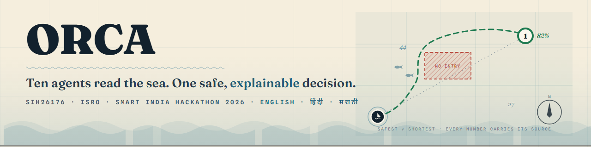
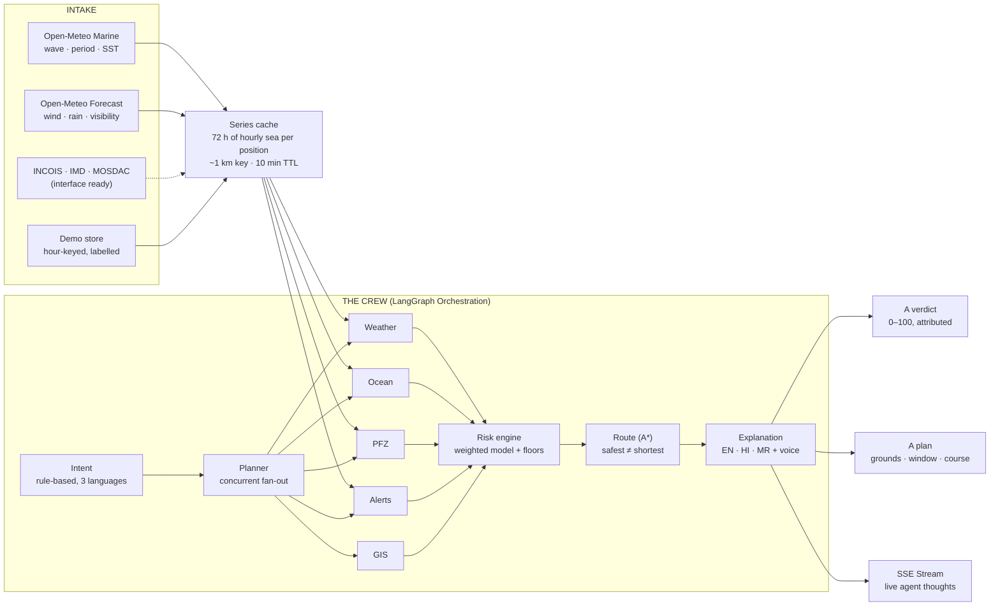

<div align ="center">



### Marine EcOsystem Reasoning with Collaborative Agents (ORCA 2.0)

**Ten agents read the sea. One safe, explainable decision — in the fisher's own language.**

[](https://sih.gov.in)
[](https://sih.gov.in)
[](#the-stack)
[](#the-stack)
[](#architecture)
[](#the-stack)
[](#live-data--what-we-actually-do-with-it)
[](#quickstart)

*"Can I go fishing tomorrow at 6 AM?" is a life-or-death question on India's coast.*  
*ORCA answers it with evidence, in Marathi, Hindi or English — and shows its working.*

</div>

---

## 🌊 The One-Line Pitch

> ORCA is **not a chatbot**. It is a crew of ten cooperating agents orchestrated by **LangGraph** that turn India's marine data into one safe, explainable decision for a fisher — where the fish are, whether it is safe to go, when to leave, how long to stay, and which course avoids the areas that get boats fined or worse. Every number carries its **source, timestamp, and confidence**. Official warnings **override everything**.

ORCA is decision support. It never replaces official IMD / INCOIS advisories or Coast Guard instructions — and it says so, on every screen.

---

## 🚀 Key Features of ORCA 2.0

### 1. LangGraph Agent Pipeline
ORCA replaces legacy threading with a robust **LangGraph orchestration pipeline**. Ten specialized agents execute concurrently, sharing a state graph. The risk engine strictly waits for all of them; no agent's opinion can skip the safety check.

### 2. Native Voice Integration (Sarvam AI)
Fishers can speak to ORCA in **English, Hindi, or Marathi**. 
- **In-browser Audio Processing**: The frontend natively captures and converts raw microphone `audio/webm` to `WAV (16kHz PCM)` entirely in the browser using the Web Audio API.
- **Sarvam AI APIs**: Cleanly streams audio to Sarvam's **Saaras (STT)** and generates responses with **Bulbul (TTS)** over a unified REST pipeline.

### 3. Live Agent Progress (SSE Streaming)
Never wait blindly. Using **Server-Sent Events (SSE)**, ORCA streams the exact thoughts, latencies, and statuses of each agent directly to the Ask ORCA UI (both Desktop and Mobile) in real-time while they work.

### 4. The Living Nautical Chart
The `MarineMap` component isn't just a map; it's a dynamic nautical chart featuring:
- **Port Markers**: Interactive anchor icons for landing centres (`/api/map/ports`).
- **Potential Fishing Zones (PFZ)**: INCOIS advisory fallbacks displayed when precise scored grounds are missing.
- **Draggable Vessel**: Geofenced live location dropping to dynamically test areas for safety.
- **Live Wind/Current particles**: Animated flows indicating marine conditions.

### 5. Multi-platform UIs (Desktop & Mobile)
- **Mobile First**: PWA-ready design featuring heavy use of audio interfaces, quick risk banners (`AlertsPanel`), and simplified layouts.
- **System / Authority Views**: The `QuickRiskPanel` and system tabs offer real-time port risk breakdowns for district authorities, updating every 30 seconds.

---

## 🏗️ Architecture & Flow



### 🧠 The Crew: Work of Each Agent
Ten independent agents run concurrently in the LangGraph graph:
1. **Intent Agent**: Deterministically parses user queries (in English, Hindi, or Marathi) for location, time, and activity. It maps spoken words to structured geographical intent without AI hallucination.
2. **Planner Agent**: Acts as the LangGraph orchestrator. It triggers the parallel execution (fan-out) of all environmental and situational agents.
3. **Weather Agent**: Queries the Series Cache for atmospheric data (wind, rain probability, visibility).
4. **Ocean Agent**: Queries the Series Cache for marine data (wave height, wave period, sea-surface temperature).
5. **PFZ Agent**: Queries INCOIS APIs (or synthetic demo stores) for Potential Fishing Zones based on chlorophyll and SST bands.
6. **Alerts (Cyclone) Agent**: Checks active IMD/Coast Guard severe warnings and bulletins for the designated area.
7. **GIS Agent**: Processes point-in-polygon ray-casting to ensure positions are not on land, inside marine protected areas, or restricted defence zones.
8. **Risk Engine Agent**: **The core safety floor.** It waits for all specialist agents to finish. It computes a base risk score (0-100) using a weighted model. Then, it applies deterministic floors (e.g., if Alerts agent says "Cyclone", score goes to 92 EXTREME). **It can only raise risk, never lower it.**
9. **Route Agent**: Uses an A* search algorithm to plot the safest (not necessarily shortest) course from port to the target, avoiding hatched danger areas and landmasses.
10. **Explanation Agent**: Takes the final Risk, Route, and Plan data and generates a highly localized, culturally relevant spoken/textual explanation in the user's language, pushing the output to Sarvam TTS.

---

## 📊 Live Data — What We Actually Do With It

**1 · Pull.** In LIVE mode, two keyless public providers are read **once per position**: Open-Meteo **Marine** and Open-Meteo **Forecast**. One response contains **72 hours of hourly data**.

**2 · Remember.** That full hourly series goes into an in-process cache keyed to the kilometre. This is why the 24-hour risk timeline costs **0.02 s instead of 32 s**: all components and agents answer from the same remembered series.

**3 · Reason.** Each specialist derives its view from the same series — the ocean agent reads wave/SST, the weather agent wind/rain/visibility, the risk engine fuses all of it and applies floors.

**4 · Prove.** Every derived number is written to the evidence ledger with `source · timestamp · confidence · mode` — the same rows the fisher sees under "Evidence", the authority exports as CSV, and the System page streams live.

**5 · Degrade honestly.** If a provider call fails, that agent falls back to the demo store **and says so** — relabelled, never silently pretending to be live.

---

## 🛠️ The Stack

**Backend** — Python 3.10 · FastAPI · pydantic v2 · **LangGraph** · httpx. **Five dependencies**, so it installs in seconds on any laptop. Geometry (haversine, ray-casting point-in-polygon, A*, the landmass layer) is pure Python: no shapely/GEOS install to fail on stage. PostGIS and XGBoost are the documented production path, not demo requirements. Voice processing is powered by **Sarvam AI (Saaras STT / Bulbul TTS)** over REST.

**Frontend** — React 18 · TypeScript · Tailwind · Leaflet · Vite. The client uses the Web Audio API to capture raw microphone `audio/webm`, converts it into `WAV (PCM 16-bit)`, and streams it natively to the backend STT endpoints via SSE.

```
orca/
├─ RUN-ORCA.bat        one-click launch
├─ backend/app/
│  ├─ agents/          intent, planner, weather, ocean, pfz, cyclone, gis,
│  │                   risk, route, explanation (orchestrated by LangGraph)
│  ├─ services/        voice (Sarvam), risk_engine, fishing (+species), route_optimizer
│  ├─ data/            geo (pure-python GIS + landmass), demo_store, live_client (series cache)
│  ├─ api/             chat, voice, fishing, forecast, map, alerts, routes
│  └─ config.py        weights, thresholds, overrides, data mode
├─ frontend/src/
│  ├─ components/      MarineMap, ChatPanel, AlertsPanel, QuickRiskPanel, RiskTimeline,
│  │                   SystemPanel, MobileApp, AuthorityPanel, AgentTrace
│  └─ App.tsx          (Main SSE stream handler and state manager)
└─ docs/               architectural notes & screenshots
```

---

## 🏁 Quickstart

**One double-click:** `RUN-ORCA.bat` — starts the backend and opens the app.

Or from a terminal:

```powershell
.\start-orca.ps1
```

Then open `http://127.0.0.1:8000` (or `http://localhost:5173` if running the dev server).

| Command | What it does |
|---|---|
| `RUN-ORCA.bat` / `.\start-orca.ps1` | Demo mode (cached, rehearsed data). **Use this on stage.** |
| `.\start-orca.ps1 -Live` | Live public providers, auto-falls back to cache per reading |
| `npm run dev` (in `/frontend`) | Hot-reload Vite HMR frontend |
| `npm run build` (in `/frontend`) | Run a full production build of the Vite app |

### Try the Deep Links:
- `/?m=1` - Mobile mode view.
- `/?tab=system` - The engine room, showing the live feed and agent pipeline.
- `/?demo=danger` - Simulates a severe IMD warning overriding the system.
- `/?demo=cyclone` - Simulates an EXTREME 92/100 cyclone warning.

---

<div align ="center">
<i>Demo / simulated data is always labelled. ORCA is decision support — it never replaces an official advisory.</i>
</div>
